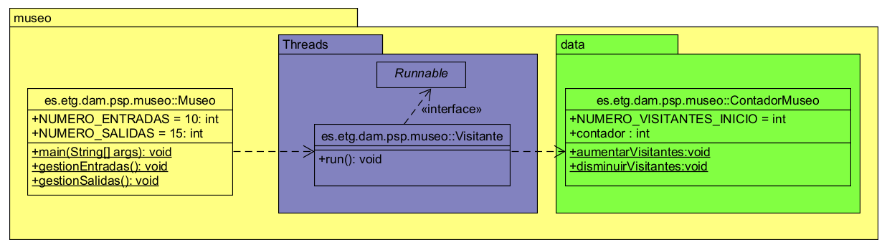

# Museo

https://github.com/AmandaSMZ/museo.git

## Análisis

### Requisitos Funcionales

1. **Gestión de Entradas y Salidas de Visitantes**:
   - El sistema debe permitir registrar las entradas y salidas de los visitantes al museo. Cada entrada incrementa el contador de visitantes y cada salida lo decrementa.

2. **Contador de Visitantes**:
   - El sistema debe mantener un contador de visitantes que refleje el número actual de personas dentro del museo.
   - El contador debe empezar con un valor inicial de 100 visitantes.
   - El contador debe ser modificado en tiempo real mediante hilos que se encargan de las entradas y salidas de los visitantes.

3. **Manejo de Múltiples Hilos**:
   - El sistema debe gestionar múltiples hilos de ejecución para representar a los visitantes, con cada hilo se ejecuta la acción de entrada o salida de un visitante de manera independiente. El número de hilos debe ser ajustable según el número de entradas y salidas requeridas.

4. **Sincronización de Acceso al Contador**:
   - El sistema debe garantizar que el acceso al contador de visitantes sea sincronizado para evitar errores de concurrencia, como las condiciones de carrera.

5. **Resultados de Salida**:
   - Al final de las operaciones de entrada y salida, el sistema debe mostrar el número final de visitantes dentro del museo.

### Requisitos No Funcionales

1. **Escalabilidad**:
   - El sistema debe ser escalable, permitiendo aumentar el número de entradas y salidas sin comprometer la estabilidad o el desempeño del sistema.

2. **Confiabilidad y seguridad**:
   - El acceso al contador debe estar sincronizado para evitar errores durante las operaciones concurrentes ni causar incoherencias en el contador de visitantes.

3. **Mantenibilidad**:
   - Debe ser fácil agregar o modificar el número de visitantes o las características del sistema en el futuro.

---

## Diseño

El sistema se compone de tres clases principales:

1. **ContadorMuseo**:
   - Esta clase maneja el contador de visitantes. Contiene métodos sincronizados `aumentarVisitantes()` y `disminuirVisitantes()` para asegurar la correcta modificación del contador.

2. **Visitante**:
   - Esta clase implementa `Runnable` y representa a un visitante que entra o sale del museo. Los hilos de entrada y salida se gestionan mediante esta clase. El tipo de visitante (entrada o salida) se determina mediante un parámetro pasado al constructor.

3. **Museo**:
   - Esta es la clase principal que gestiona el flujo de visitantes. Crea los hilos para las entradas y salidas y los ejecuta. Después de completar las operaciones, muestra el número final de visitantes.

---

## Elementos Relevantes de la Codificación

- **Sincronización**:
   El uso de métodos `synchronized` en la clase `ContadorMuseo` asegura que solo un hilo pueda modificar el contador de visitantes en cualquier momento, evitando problemas de concurrencia.

- **Hilos**:
   Se emplea la interfaz `Runnable` para definir el comportamiento de los visitantes. Los hilos se crean en el método `gestionarEntradas()` y `gestionarSalidas()` y se inician en esos mismos métodos.

- **Control de Tipos de Visitantes**:
   El tipo de visitante se maneja mediante un parámetro (`TIPO_ENTRADA` o `TIPO_SALIDA`) que indica si el hilo debe aumentar o disminuir el contador de visitantes.

---

## Métodos de Prueba

El sistema se puede probar utilizando pruebas unitarias para verificar el correcto funcionamiento de las operaciones de entrada y salida. Algunos de los casos de prueba incluyen:

1. **Prueba de Entradas**:
   - Verificar que el número de visitantes aumente en la cantidad correcta cuando se gestionan las entradas.
   
2. **Prueba de Salidas**:
   - Verificar que el número de visitantes disminuya correctamente cuando se gestionan las salidas.

3. **Prueba de Entradas y Salidas Combinadas**:
   - Comprobar que el contador de visitantes sea correcto después de realizar tanto las entradas como las salidas.
